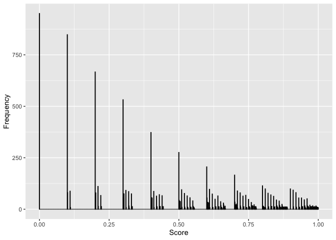

How Low Can You Roll?
================
Quoc Tran
11/15/2019

## Riddler Classic

From Ricky Jacobson comes a puzzle of seeing how low you can roll:

You are given a fair, unweighted 10-sided die with sides labeled 0 to 9
and a sheet of paper to record your score. (If the very notion of a fair
10-sided die bothers you, and you *need* to know what sort of
three-dimensional solid it is, then forget it — you have a random number
generator that gives you an integer value from 0 to 9 with equal
probability. Your loss — the die was a collector’s item.)

To start the game, you roll the die. Your current “score” is the number
shown, divided by 10. For example, if you were to roll a 7, then your
score would be 0.7. Then, you keep rolling the die over and over again.
Each time you roll, if the digit shown by the die is less than or equal
to the last digit of your score, then that roll becomes the new last
digit of your score. Otherwise you just go ahead and roll again. The
game ends when you roll a zero.

For example, suppose you roll the following: 6, 2, 5, 1, 8, 1, 0. After
your first roll, your score would be 0.6, After the second, it’s 0.62.
You ignore the third roll, since 5 is greater than the current last
digit, 2. After the fourth roll, your score is 0.621. You ignore the
fifth roll, since 8 is greater than the current last digit, 1. After the
sixth roll, your score is 0.6211. And after the seventh roll, the game
is over — 0.6211 is your final score.

What will be your *average* final score in this game?

## My Solution

There’s probably a cool math way to do this, but I’ll just Monte Carlo
it.

``` r
library(ggplot2)
scores <- c()
for (i in 1:10000) {
  score <- 0
  prevRoll <- 9
  numRoll <- 0
  inLoop <- TRUE
  
  while(inLoop) {
    numRoll <- numRoll + 1
    roll <- sample(0:9,1)
    if (roll <= prevRoll) {
      score <- score + (roll * (10^(-numRoll)))
      prevRoll <- roll
    }
    if (roll == 0) {
      inLoop <- FALSE
    }
  }
  
  scores <- c(scores,score)
}
print(mean(scores))
```

    ## [1] 0.467584

``` r
ggplot() + 
  aes(scores) + 
  geom_histogram(binwidth=0.001, colour="black", fill="black") +
  ylab("Frequency") +
  xlab("Score")
```

<!-- -->
