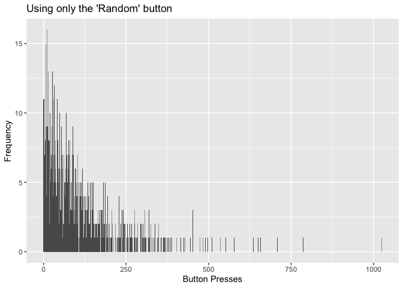
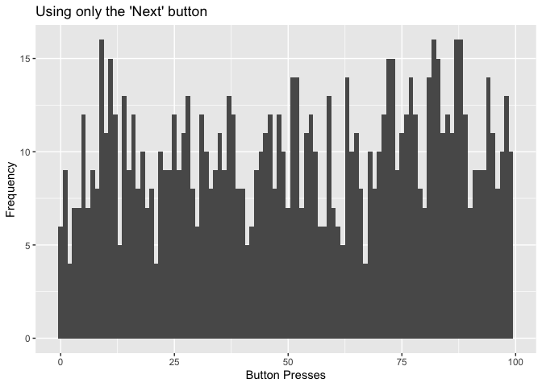
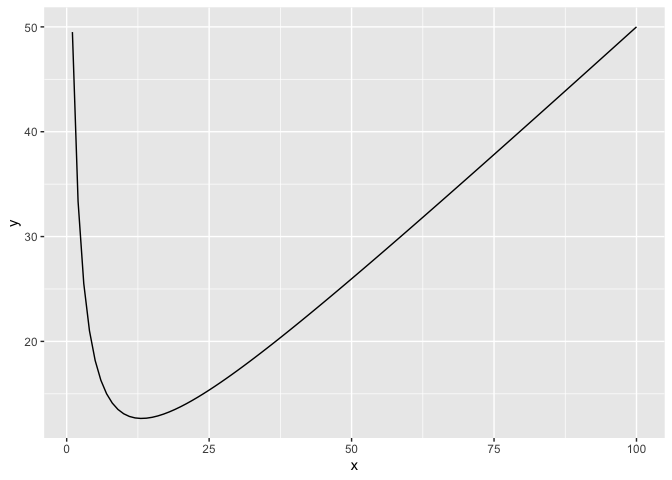
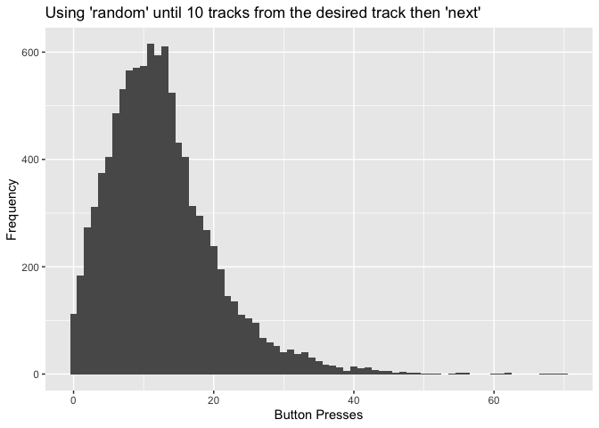

How Fast Can You Skip To Your Favorite Song?
================
Quoc Tran
12/06/2019

## Riddler Classic

From Austin Chen comes a riddle of efficiently finding a song:

You have a playlist with exactly 100 tracks (i.e., songs), numbered 1 to
100. To go to another track, there are two buttons you can press: (1)
“Next,” which will take you to the next track in the list or back to
song 1 if you are currently on track 100, and (2) “Random,” which will
take you to a track chosen uniformly from among the 100 tracks. Pressing
“Random” can restart the track you’re already listening to — this will
happen 1 percent of the time you press the “Random” button.

For example, if you started on track 73, and you pressed the buttons in
the sequence “Random, Next, Random, Random, Next, Next, Random, Next,”
you might get the following sequence of track numbers: 73, 30, 31, 67,
12, 13, 14, 89, 90. You always know the number of the track you’re
currently listening to.

Your goal is to get to your favorite song (on track 42, [of
course](https://www.independent.co.uk/life-style/history/42-the-answer-to-life-the-universe-and-everything-2205734.html))
with as few button presses as possible. What should your general
strategy be? Assuming you start on a random track, what is the average
number of button presses you would need to make to reach your favorite
song?

## My Solution

We can first test a few simple algorithms, such as clicking only the
“random” button or only the “next” button. These strategies will
likely not yield the optimum results. The optimum strategy is likely
hitting the “random” button and then using the “next” button. We will
explore all of these strategies mathematically and by running
simulations.

Here’s some reusable code that we can use when testing different
algorithms

``` r
library(ggplot2)

numPresses <- 0
currTrack <- sample(1:100,1)

newRun <- function() {
  numPresses <<- 0
  currTrack <<- sample(1:100,1)
}

pressNext <- function() {
  numPresses <<- numPresses + 1
  currTrack <<- currTrack + 1
  if (currTrack == 101) {
    currTrack <<- 1
  }
}

pressRandom <- function() {
  numPresses <<- numPresses + 1
  currTrack <<- sample(1:100,1)
}
```

### Using only the random button

This algorithm will only hit the random button. Mathematically, it
should take an average of 100 button presses of the “random” button to
arrive at our desired track out of 100 tracks. We can run 10,000
simulations and get a histogram of how many presses it takes to get to
our track.

``` r
allRuns <- c()

for (run in 1:10000) {
  newRun()
  while (currTrack != 42) {
    pressRandom()
  }
  allRuns <- c(allRuns,numPresses)
}

ggplot() + 
  aes(allRuns) + 
  geom_histogram(binwidth=1) +
  ylab("Frequency") +
  xlab("Button Presses") +
  ggtitle("Using only the 'random' button")
```

<!-- -->

``` r
print(mean(allRuns))
```

<<<<<<< HEAD
    ## [1] 98.1592
=======
    ## [1] 98.0365
>>>>>>> cb68cdba161e235335c3469ee495efb637e780ed

### Using only the next button

This algorithm will only hit the next button. Given a random starting
point and that the tracks loop from 100 to 1, it should take an average
of 50 button presses to arrive at our desired track. We can run 10,000
simulations and get a histogram of how many presses it takes to get to
our track.

``` r
allRuns <- c()

for (run in 1:10000) {
  newRun()
  while (currTrack != 42) {
    pressNext()
  }
  allRuns <- c(allRuns,numPresses)
}

ggplot() + 
  aes(allRuns) + 
  geom_histogram(binwidth=1) +
  ylab("Frequency") +
  xlab("Button Presses") +
  ggtitle("Using only the 'next' button")
```

<!-- -->

``` r
print(mean(allRuns))
```

<<<<<<< HEAD
    ## [1] 49.3898
=======
    ## [1] 49.4655
>>>>>>> cb68cdba161e235335c3469ee495efb637e780ed

## Using the random button then then next button

This algorithm will press the random button until it’s “close enough” to
the desired track, then it will hit the next button to get to the
desired track. Intuitively, this seems like the most optimal strategy.
The problem lies in finding out what’s “close enough”. The number of
average button presses total \(y\) can be determined from how close to
the desired track the algorithm will switch over to pressing the next
button \(x\), using this equation:

\[y = \frac{99}{(x-1)} (1 - \frac{x}{100}) + \frac{x}{2}\]

In our equation, the \(\frac{99}{(x-1)}\) is the average number of
presses needed to get within \(x\) of the desired track, the term
\((1 - \frac{x}{100})\) accounts for the probability of our starting
track already being within the “close enough” range. The
\(+\frac{x}{2}\) is the additional number of clicks needed to get from
being in the range to the desired track, given that you can appear
anywhere in the range with equal probability.

For example, if our “close enough” value \(x\) is 20, then the average
number of button presses \(y\) to get to the desired track will be
\(y = \frac{99}{(20-1)} (1 - \frac{20}{100}) + \frac{20}{2} = 14.17\).
To find the optimal “close enough” value of \(x\) all we have to do is
solve for the local minimum of the equation where \(x = [1,100]\).

``` r
myFunc <- function(x) {
  y <- (99/(x+1)) * (1-(x/100)) + (x/2)
  return(y)
}
df <- data.frame(1:100, myFunc(1:100))
colnames(df) <- c("x","y")
ggplot(df, aes(x=x, y=y)) + 
  geom_point(alpha=0) + 
  geom_line()
```

<!-- -->

``` r
print(paste("(",df$x[df$y==min(df$y)],",",round(min(df$y),digits=2),")",sep=""))
```

    ## [1] "(13,12.65)"

The local minimum in our domain is \(x = 13\) which results in
\(y = 12.65\). With this, we can run 10,000 simulations and get a
histogram of how many presses it takes to get to our track.

``` r
allRuns <- c()

for (run in 1:10000) {
  newRun()
  while (currTrack != 42) {
    if ((42 - 13 > currTrack) || (currTrack > 42)) {
      pressRandom()
    } else {
      pressNext()
    }
  }
  allRuns <- c(allRuns,numPresses)
}

ggplot() + 
  aes(allRuns) + 
  geom_histogram(binwidth=1) +
  ylab("Frequency") +
  xlab("Button Presses") +
<<<<<<< HEAD
  ggtitle("Using 'random' until 10 tracks from the desired track then 'next'")
=======
  ggtitle("Using 'Random' until 10 tracks from the desired track then 'Next'")
>>>>>>> cb68cdba161e235335c3469ee495efb637e780ed
```

<!-- -->

``` r
print(mean(allRuns))
```

<<<<<<< HEAD
    ## [1] 12.5756
=======
    ## [1] 12.6321
>>>>>>> cb68cdba161e235335c3469ee495efb637e780ed

Our simulations match the model. The optimal strategy is to click the
“random” button until we get within 13 songs of our desired track,
then to hit the “next” button. This will get us to the desired track
with 12.7 button presses on average.
