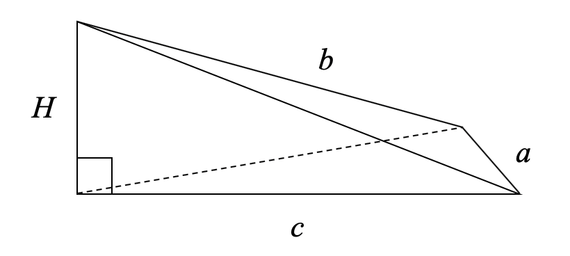
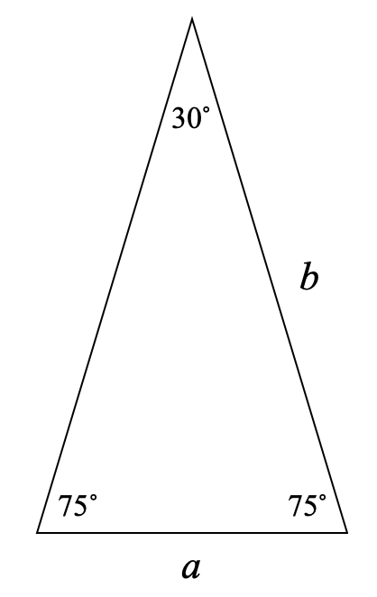
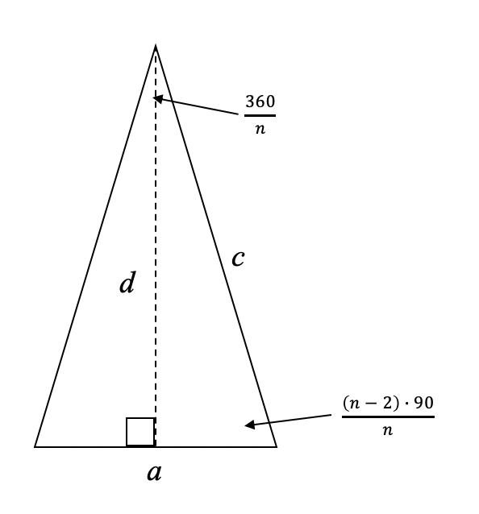
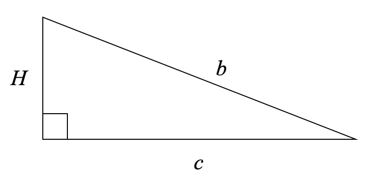

```{r setup, include=FALSE}
knitr::opts_chunk$set(echo = TRUE)
```

### [Riddler Classic](https://fivethirtyeight.com/features/can-you-roll-the-perfect-bowl/)

#### By Zach Wissner-Gross

From Robert Berger comes a question of maximizing magnetic volume:

Robert’s daughter has a set of [Magna-Tiles](https://www.magnatiles.com), which, as their name implies, are tiles with magnets on the edges that can be used to build various polygons and polyhedra. Some of the tiles are identical isosceles triangles with one 30 degree angle and two 75 degree angles. If you were to arrange 12 of these tiles with their 30 degree angles in the center, they would lay flat and form a regular dodecagon. If you were to put fewer (between three and 11) of those tiles together in a similar way, they would form a pyramid whose base is a regular polygon. Robert has graciously provided a photo of the resulting pyramids when three and 11 tiles are used:


If Robert wanted to maximize the volume contained within the resulting pyramid (presumably to store as much candy for his daughter as possible), how many tiles should he use?

***

## My Solution

Solving this is relatively straight forward, we just need to create a general formula relating the number of Magna-Tiles $n$ to the volume of the final pyramid. The shape made up of $n$ Magna-Tiles, will be a pyramid with an $n$-gon as its base. We can instead slice up this shape visualize it as $n$ triangular pyramids:



Where $a$ is the side length of our Magna-Tile, we can solve for the volume of this triangular pyramid using this general formula:

$$V = \frac{1}{3} \cdot A_{base} \cdot H$$

First, we can most easily solve for the outer triangle of this pyramid, which is the Magna-Tile itelf. Here, using the law of sines, side $b$ can be defined in terms of side $a$. We'll need this later to solve for the height $H$ of our pyramid.

$$b = a \cdot \frac{sin(75˚)}{sin(30˚)}$$



We need to next solve for the area of the triangle at the base of triangular pyramid. This triangle is an isosceles, defined by the number $n$ of Magna-Tiles in our pyramid. The base of the pyramid as a whole is a regular polygon with $n$ sides of length $a$.

We know that the total of the internal angles of a polygon is $(n-2) \cdot 180$, so the two base angles of our isosceles triangle have an angle of $\frac{(n-2) \cdot 90}{n}$. The last angle of our isosceles triangle forms a circle with the rest of the triangles in the polygon, so its angle is $\frac{360}{n}$.



To solve for the area of this isosceles triangle, we can first find its height $d$ by using trigonometry:

$$d = \frac{a}{2 \cdot tan(\frac{180}{n})}$$
So, the area of this triangle at the base of our trianglular pyramid is:

$$Area_{base} = \frac{1}{2} \cdot a \cdot d = \frac{a^2}{4 \cdot tan(\frac{180}{n})}$$

We can also solve the triangle to find side $c$, which will be useful in finding the height $H$ of our triangular pyramid. This can be done again using the law of sines:

$$c = a \cdot \frac{sin(\frac{(n-2)\cdot90}{n})}{sin(\frac{360}{n})}$$


The only side that we still need is the height $H$ of our triangular pyramid. We can look at the triangle in between our triangular pyramids as a right triangle. Since we know the values of $b$ and $c$, we can just use the pythagorean theorem to find $H$

$$H = \sqrt{b^2 - c^2} = \sqrt{(a \cdot \frac{sin(75˚)}{sin(30˚)})^2 - (a \cdot \frac{sin(\frac{(n-2)\cdot90}{n})}{sin(\frac{360}{n})})^2}$$



With both the area of the triangle at the base and $H$, we can find volume of the triangular pyramid and multiply it by the $n$ Magna-Tiles used in the whole pyramid.

$$V = n \cdot \frac{1}{3} \cdot \frac{a^2}{4 \cdot tan(\frac{180}{n})} \cdot \sqrt{(a \cdot \frac{sin(75˚)}{sin(30˚)})^2 - (a \cdot \frac{sin(\frac{(n-2)\cdot90}{n})}{sin(\frac{360}{n})})^2}$$

This is the general form of the equation that we can use to find the total volume of the pyramid formed by $n$ Magna-Tiles with base length $a$. I'm sure this can be simplified a lot further, but it's good enough for our purposes and I've reached the limit of my math knowledge, so we can just find the minimum of this by plotting the volume for $a=[3,11]$

```{r}
library(ggplot2)

vol <- function(n, a = 1) {
  b <- a * (sin(75 *(pi/180))/sin(30 *(pi/180)))
  d <- a / (2 * tan((180/n) *(pi/180)))
  areaBase <- 0.5 * a * d
  c <- a * (sin((((n-2)*90)/n) *(pi/180)) / sin((360/n) *(pi/180)))
  H <- sqrt((b^2) - (c^2))
  V <- (1/3) * areaBase * H
  return(V)
}

df <- data.frame(x = 3:11, y = vol(3:11))

m

```

A pyramid created from 9 Magna-Tiles will have the maximum volume.