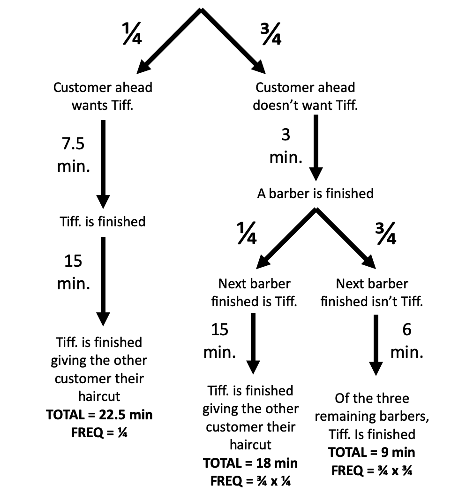

```{r setup, include=FALSE}
knitr::opts_chunk$set(echo = TRUE)
```

### [Riddler Classic](https://fivethirtyeight.com/features/can-you-get-a-haircut-already/)

#### By Zach Wissner-Gross

From Dave Moran comes a question we’ve all faced at some point when waiting in line for a haircut:

At your local barbershop, there are always four barbers working simultaneously. Each haircut takes exactly 15 minutes, and there’s almost always one or more customers waiting their turn on a first-come, first-served basis.

Being a regular, you prefer to get your hair cut by the owner, Tiffany. If one of the other three chairs opens up, and it’s your turn, you’ll say, “No thanks, I’m waiting for Tiffany.” The person behind you in line will then be offered the open chair, and you’ll remain at the front of the line until Tiffany is available.

Unfortunately, you’re not alone in requesting Tiffany — a quarter of the other customers will hold out for Tiffany, while no one will hold out for any of the other barbers.

One Friday morning, you arrive at the barber shop to see that all four barbers are cutting hair, and there is one customer waiting. You have no idea how far along any of the barbers is in their haircuts, and you don’t know whether or not the customer in line will hold out for Tiffany.

What is the expected wait time for getting a haircut from Tiffany?

***

## My Solution

First, we need to figure out when any one barber will be finished. The general solution to this problem is that the expected wait time for one of $n$ barbers to finish their haircut is $\frac{t}{n + 1}$, given $t$ amount of time needed to give a haircut.

This is derived from the fact that upon walking into the barbershop, the time left in each haircut can be described as a uniform distribution between time $0$ and $t$. The $n + 1$ term divides this timeline into $n$ breaks, which each break representing where one barber is along in their haircut.

We can solve this puzzle using a flowchart.

There is a $\frac{1}{4}$ chance that the customer ahead of us will want Tiffany. From the moment of walking into the barbershop, the expected wait time for Tiffany to finish specifically is $\frac{15}{1 + 1} = 7.5$ minutes. Then, it will take another $15$ minutes for that haircut to finish. It doesn't matter what the other barbers do in this case $\frac{1}{4}$ of the time it will take $22.5$ minutes until we can get a haircut from Tiffany.

$\frac{3}{4}$ of the time, though, the customer ahead of us will not want Tiffany. After $\frac{15}{4 + 1} = 3$ minutes, one of the four barbers will finish. Here the situation splits into two again, depending on which barber is finishd first.

There is a $\frac{1}{4}$ chance that the next barber finished will be Tiffany anyways. In this case, we have to wait another $15$ mintues for Tiffany to finish that haircut. The total wait time is, then, $18$ minutes and this situation has a $\frac{3}{4} \cdot \frac{1}{4} = \frac{3}{16}$ chance of occuring.

Another $\frac{3}{4}$ of the time, the next barber finished won't be Tiffany and the customer in front of us gets their hair cut by another barber. Now, of the $3$ remaining barbers, we can figure out when Tiffany will be finished using our equation again. Since $3$ minutes has already elapsed, the maximum wait time for a haircut ($t$ in our equation) to be finished is now $12$ instead of $15$ minutes. The expected wait time now for Tiffany to finish her haircut is $\frac{12}{1 + 1} = 6$ minutes. The total wait time is $9$ minutes and this situation has a $\frac{3}{4} \cdot \frac{3}{4} = \frac{9}{16}$ chance of occuring.



```{r}
(22.5 * 0.25) + (18 * 0.75 * 0.25) + (9 * 0.75 * 0.75)
```

Adding the expected frequencies of these situations together, we get that the expected wait time for getting a haircut from Tiffany is $14.0625$ minutes.

Clearly the next step is now finding a generalizable solution to this situation where there are $N$ customers in line ahead of you. The math seems complicated, so we'll fall back on our old friend, Monte Carlo experiments:

```{r}
simBarbers <- function(N, simNum = 5000) {
  allTime <- c() # stores the results of each simulation
  for (i in 1:simNum) {
    time <- 0
    # generate the barbers (barber[1] is Tiffany)
    barbers <- sample(seq(0.1, 15, by = 0.1), 4)
    # generate the customers (first in line to last, TRUE wants Tiffany)
    customers <- sample(c(TRUE, FALSE), prob = c(0.25, 0.75), N, replace = TRUE)
    
    while (length(customers) > 0) {
      
      # one barber is freed up after time t
      t <- min(barbers)
      time <- time + t
      barbers <- barbers - t
      
      # assigns the free barber to give one customer a haircut
      if (customers[1]) { # customer wants Tiffany
        if (barbers[1] == 0) { # Tiffany is available
          customers <- customers[-1]
        } else { # Tiffany isn't available
          if (FALSE %in% customers) { # someone left in line doesn't care who they get
            customers <- customers[-match(FALSE, customers)] # the next person who doesn't care gets a haicut
          } else { # everyone left in line wants Tiffany -- resolves entire customer line at once
            time <- time + barbers[1]
            time <- time + (15 * (length(customers) - 1)) # minus 1 since the loop adds 15 min at the end still
            customers <- customers[-(1:length(customers))]
            barbers[1] <- 0
          }
        }
      } else { # customer doesn't want Tiffany
        customers <- customers[-1]
      }
      barbers[barbers == 0] <- 15 # the barber now has 15 more minutes
    }
    # now it's our turn for a haircut
    time <- time + barbers[1]
    allTime <- c(allTime, time)
  }
  return(allTime)
}

df <- data.frame(customers = 0:15, wait = 0, err = 0)

for (row in 1:nrow(df)) {
  simTime <- simBarbers(df[row, "customers"])
  df[row, "wait"] <- mean(simTime)
  df[row, "err"] <- sd(simTime)
}
```

Our simulations recapitulate our analytical solution in the case of one customer and, on the whole, the relationship between the number of customers ahead of us and our expected wait time seems to be linear.

```{r}
print(df[df$customers == 1, "wait"])
```

```{r}
library(ggplot2)
library(emoGG)

ggplot(df, aes(x = customers, y = wait)) +
  geom_errorbar(aes(ymin = wait - err, ymax = wait + err), width = 0.1) +
  geom_emoji(emoji = "1f488") +
  ggtitle("Expected Wait Time to Get a Haircut from Tiffany") +
  labs(subtitle = "From 5000 simulations each") +
  xlab("Customers Ahead in Line") +
  ylab("Expected Wait Time (minutes)")
```


