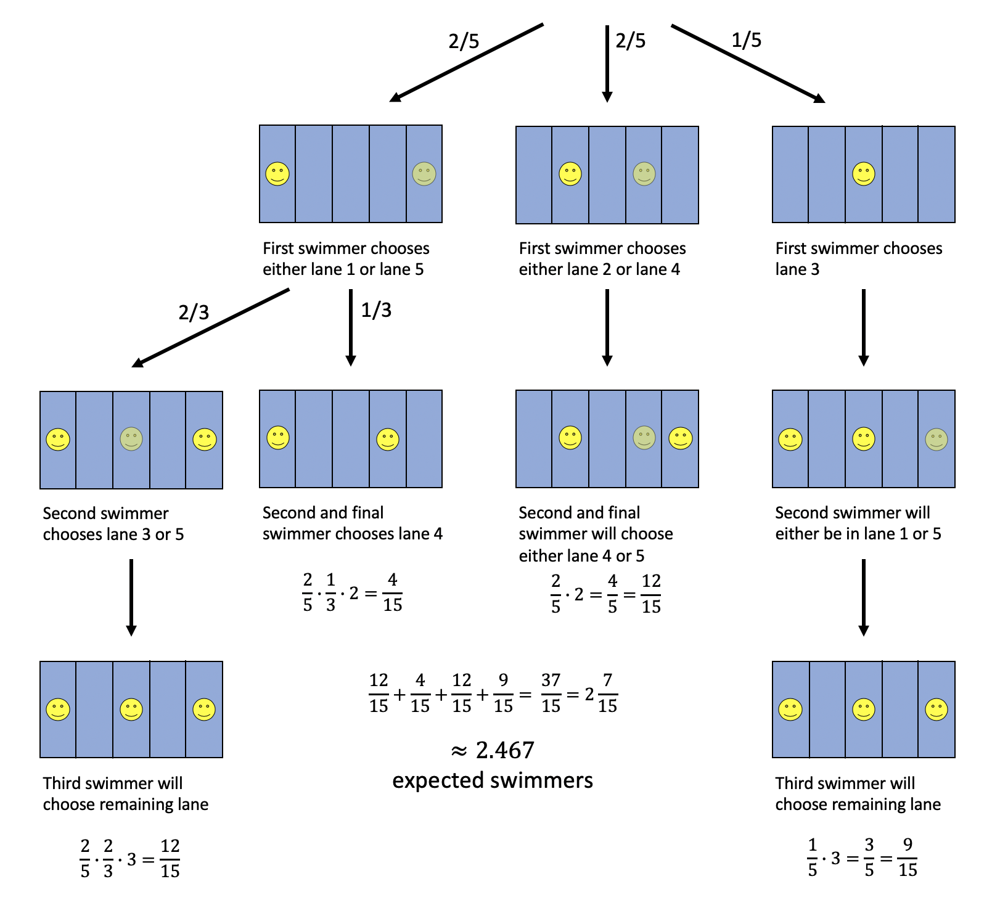
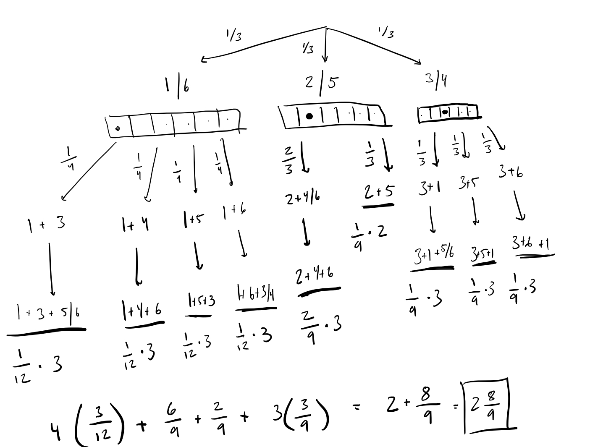
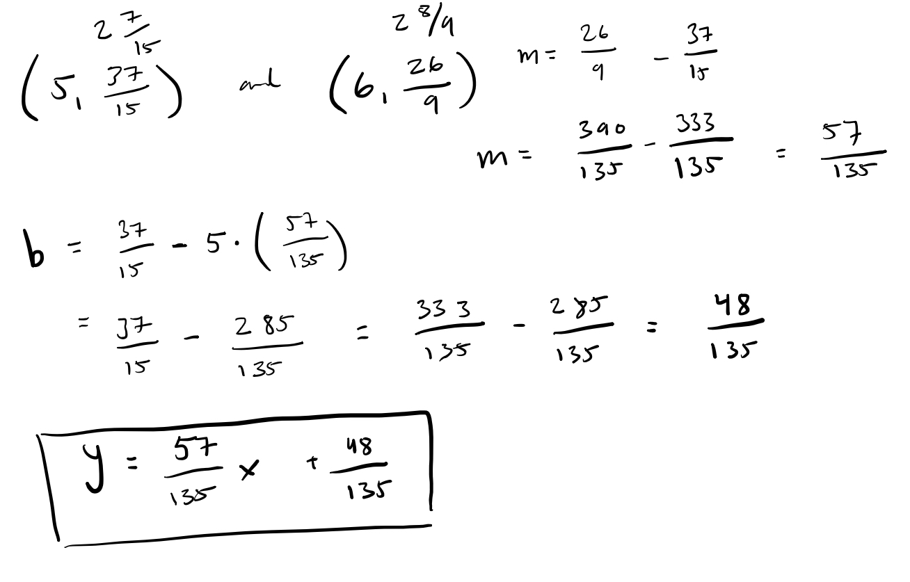

```{r setup, include=FALSE}
knitr::opts_chunk$set(echo = TRUE)
```

### [Riddler Classic](https://fivethirtyeight.com/features/can-you-stay-in-your-lane/)

#### By Zach Wissner-Gross

It’s summertime and my local swimming pool, which has exactly five swimming lanes (and no general swim area), may be opening in the coming weeks. It remains unclear what social distancing practices will be required, but it’s quite possible that swimmers will not be allowed to occupy adjacent lanes.

Under these guidelines, the pool could accommodate at most three swimmers — one each in the first, third and fifth lanes.

Suppose a queue of swimmers arrives at the pool when it opens at 9 a.m. One at a time, each person randomly picks a lane from among the lanes that are available (i.e., the lane has no swimmer already and is not adjacent to any lanes with swimmers), until no more lanes are available.

At this point, what is the expected number of swimmers in the pool?

*Extra credit*: Instead of five lanes, suppose there are *N* lanes. When no more lanes are available, what is the expected number of swimmers in the pool?

***

## My Solution

This one can be solved with a pretty simple flowchart to calculate the probability of each event that will lead to a distinct number of swimmers in the pool and use that to find the expected number of swimmers that will end up in the pool.



Now that that's done, we can have some fun with the extra credit and do a few simulations -- also to confirm my analytical solution, because I'm not super confident that it's right.

```{r}
simOnce <- function (nLanes = 5) {
  
  lanes <- rep.int(FALSE, nLanes)
  lanesAvailable <- TRUE
  
  while (lanesAvailable) {
    availableLanes <- !lanes
    for (i in which(lanes)) {
      if (i == 1) {
        availableLanes[i + 1] <- FALSE
      } else if (i == nLanes) {
        availableLanes[i - 1] <- FALSE
      } else {
        availableLanes[i + 1] <- FALSE
        availableLanes[i - 1] <- FALSE
      }
    }
    if (TRUE %in% availableLanes) {
      if (length(which(availableLanes)) == 1) {
        lanes[which(availableLanes)] <- TRUE
      } else {
        lanes[sample(which(availableLanes), 1)] <- TRUE
      }
    } else {
      lanesAvailable <- FALSE
    }
  }
  
  return(sum(lanes))
}
```

```{r}
runSims <- function (lanes, nSims = 1000) {
  allSims <- c()
  for (i in 1:1000) {
    allSims <- c(allSims, simOnce(nLanes = lanes))
  }
  return(mean(allSims))
}
```

```{r}
print(runSims(lanes = 5, nSims = 10000))
```

This is pretty good! It seems like my exact flowchart answer is right and the simulation is working as expected (unless they're both wrong or something). Onto the extra credit:

```{r}
df <- data.frame(lanes = 5:100, swimmers = 0)
for (row in 1:nrow(df)) {
  lanes = df[row,"lanes"]
  df[row,"swimmers"] = runSims(lanes)
}
```

```{r}
library(ggplot2)
```

```{r}
ggplot(df) +
  geom_point(aes(x=lanes,y=swimmers))
```

Okay, it seems like the relation between lanes and the expected number of swimmers is just a straight line, so it should actually be pretty easy to express as an equation. I can just find the exact solution for six lanes using the same flowchart strategy for five lanes and use both answers and to fit into a $y=mx+b$ equation.



```{r}
print(runSims(lanes = 6, nSims = 10000))
```

If nothing else, it looks like I've done the flowchart correctly for six lanes! Now, we can try to fit the two points into the form of $y=mx+b$.



I hope my math's right.

```{r}
myEq <- function (x) {
  return((x * (57/135)) + (48/135))
}

df_eq <- data.frame(lanes = 5:100, swimmers = 0)
for (row in 1:nrow(df_eq)) {
  lanes = df[row,"lanes"]
  df_eq[row,"swimmers"] = myEq(lanes)
}

ggplot(data = NULL) +
  geom_point(data = df, aes(x=lanes,y=swimmers)) +
  geom_line(data =df_eq, aes(x=lanes,y=swimmers))
```

Oof. It's slightly diverging?