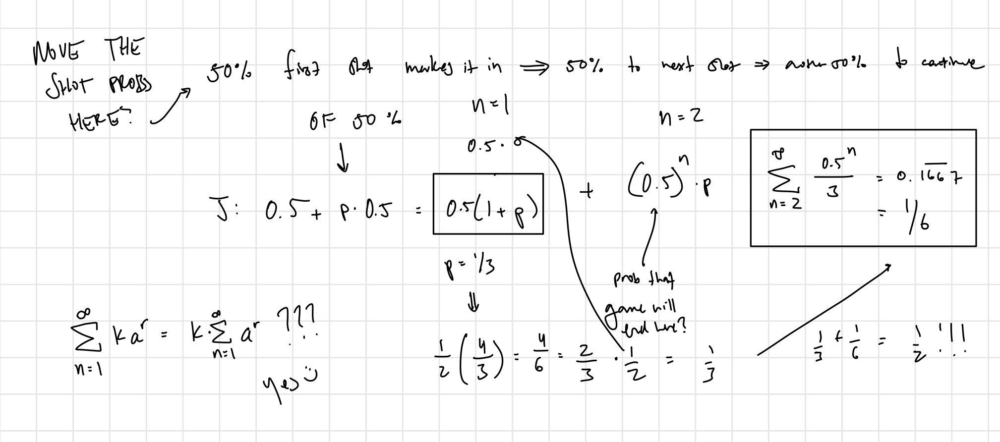

```{r setup, include=FALSE}
knitr::opts_chunk$set(echo = TRUE)
```

### [Riddler Classic](https://fivethirtyeight.com/features/can-you-feed-the-hot-hand/)

#### By Zach Wissner-Gross

Now that LeBron James and Anthony Davis have restored the Los Angeles Lakers to glory with their [recent victory](https://fivethirtyeight.com/features/lebron-and-ad-are-the-heroes-but-the-sum-of-this-laker-club-was-more-than-its-superstar-parts/) in the NBA Finals, suppose they decide to play a game of sudden-death, one-on-one basketball. They’ll flip a coin to see which of them has first possession, and whoever makes the first basket wins the game.

Both players have a 50 percent chance of making any shot they take. However, Davis is the [superior rebounder](https://www.espn.com/nba/stats/player/_/season/2020/seasontype/2/table/general/sort/avgRebounds/dir/desc) and will always rebound any shot that either of them misses. Every time Davis rebounds the ball, he dribbles back to the three-point line before attempting another shot.

Before each of Davis’s shot attempts, James has a probability *p* of stealing the ball and regaining possession before Davis can get the shot off. What value of *p* makes this an evenly matched game of one-on-one, so that both players have an equal chance of winning *before* the coin is flipped?

***

### My Solution

I can't wrap my head around how to tackle this problem analytically. I'll start by running simulations since that seems to be the easiest way to see what's going on here.

```{r}
simGame <- function (pSteal) {
  # this is the coinflip at the beginning
  possession <- sample(c("james", "davis"), 1)
  gameEnd <- F
  # each cycle starts with a player about to shoot the ball
  while (!gameEnd) {
    # james will try and steal the ball before every shot (if it's own shot this doesn't matter)
    # at the beginning bc twitter clarification
    if (sample(c(T,F), 1, prob = c(pSteal, 1-pSteal))) {
      possession <- "james"
    }
    
    # the player in possession will try and make the shot
    if(sample(c(T,F), 1)) {
      gameEnd <- T # idk if this is strictly necessary bc we're using return()
      return(possession)
    }
    
    # davis gets the rebound
    possession <- "davis"
  }
}
```

```{r}
nSims <- 1000
df <- data.frame(pSteal = seq(0, 1, by = 0.01), meanJamesWin = 0, sdJamesWin = 0)
for (row in 1:nrow(df)) {
  p <- df[row, "pSteal"]
  winners <- c()
  for (i in 1:nSims) {
    winners <- append(winners, simGame(p))
  }
  df[row, "meanJamesWin"] <- mean(winners == "james")
  df[row, "sdJamesWin"] <- sd(winners == "james")
}
```

```{r}
library(ggplot2)
library(ggpubr)
ggplot(df) +
  geom_point(aes(x = pSteal, y = meanJamesWin)) +
  ylab("Probability of LeBron James Winning") +
  xlab("Probability of LeBron James Stealing the Ball") +
  theme_pubr()
```

It's linear — that makes our job pretty easy.

```{r}
model <- lm(meanJamesWin ~ pSteal, data = df)
print(paste("The probability of either player winning becomes 0.5 when James's probability of stealing the ball is", round((0.5 - model$coefficients[1])/model$coefficients[2], 3)))
```

Cool, so the answer is probably one-third and working through the simulation loop gave me a tiny bit of intuition for solving this problem analytically.

The game can be split into two parts: the very first shot attempt right after the coin toss and every shot attempt after. The first shot attempt is a tiny bit different because you have the coin toss ($\frac{1}{2}$) in addition with the probability that James can steal the ball in the case that Davis is in possession ($\frac{1}{2}p$). This is then multipled by probability that whoever is in possession of the ball will end the game in sudden-death then and there ($\frac{1}{2}$). The probability of James winning on the first shot is:

$$(\frac{1}{2} + \frac{1}{2}p) \cdot \frac{1}{2} =  \frac{1+p}{4}$$

We can now just add the probabilities of James winning on every subsequent round. The probability of the game ending on shot $n$ is $(\frac{1}{2})^n$. We can just multiply that by $p$ which becomes the probability that James steals the ball after Davis gets the rebound

$$\sum\limits_{n=2}^\infty p \cdot (\frac{1}{2})^n$$

which simplifies and converges to

$$\frac{p}{2}$$

Adding both terms together we get that for probability $p$ of James stealing the ball before each shot, the chance that he wins the sudden-death game before the coin toss is

$$\frac{1 + 3p}{4}$$

Setting the expression equal to $\frac{1}{2}$ we can solve for $p$ and get that it equals $\frac{1}{3}$ which matches what we found with our simulations! Here's the math that I did to kind of figure this out — it's probably illegible at best.



Now, we can really have some fun with this:

```{r}
simGame2 <- function (pSteal, pRebound) {
  # this is the coinflip at the beginning
  possession <- sample(c("james", "davis"), 1)
  gameEnd <- F
  # each cycle starts with a player about to shoot the ball
  while (!gameEnd) {
    # james will try and steal the ball before every shot (if it's own shot this doesn't matter)
    # at the beginning bc twitter clarification
    if (sample(c(T,F), 1, prob = c(pSteal, 1-pSteal))) {
      possession <- "james"
    }
    
    # the player in possession will try and make the shot
    if(sample(c(T,F), 1)) {
      gameEnd <- T # idk if this is strictly necessary bc we're using return()
      return(possession)
    }
    
    # davis gets the rebound with pRebound
    possession <- sample(c("davis", "james"), 1, prob = c(pRebound, 1-pRebound))
  }
}
```

```{r, eval = F}
df2 <- expand.grid(pSteal = seq(0, 1, by = 0.01), 
                   pRebound = seq(0, 1, by = 0.01), 
                   jWin = 0)
nSims <- 1000
for (row in 1:nrow(df2)) {
  pSteal <- df2[row, "pSteal"]
  pRebound <- df2[row, "pRebound"]
  winners <- c()
  for (i in 1:nSims) {
    winners <- append(winners, simGame2(pSteal, pRebound))
  }
  df2[row, "jWin"] <- mean(winners == "james")
}
write.csv(df2, "2paramDF.csv")
```

```{r, eval = F}
df2 <- read.csv("heatmapDF.csv")
df2[df2$jWin < 0.52 & df2$jWin > 0.48, "jWin"] = 1

ggplot(df2, aes(pSteal, pRebound)) +
  geom_raster(aes(fill = jWin), color = "white") +
  scale_fill_gradient(low = "#FDB927", high = "#552583") +
  scale_x_continuous(breaks = seq(0, 1, by = 0.2), expand = c(0, 0)) +
  scale_y_continuous(breaks = seq(0, 1, by = 0.2), expand = c(0, 0)) +
  xlab("Prob. of James Steal") +
  ylab("Prob. of Davis Rebound") +
  coord_equal() +
  theme_pubr() +
  theme(axis.title = element_text(size = 20),
        legend.position = "none")
```


